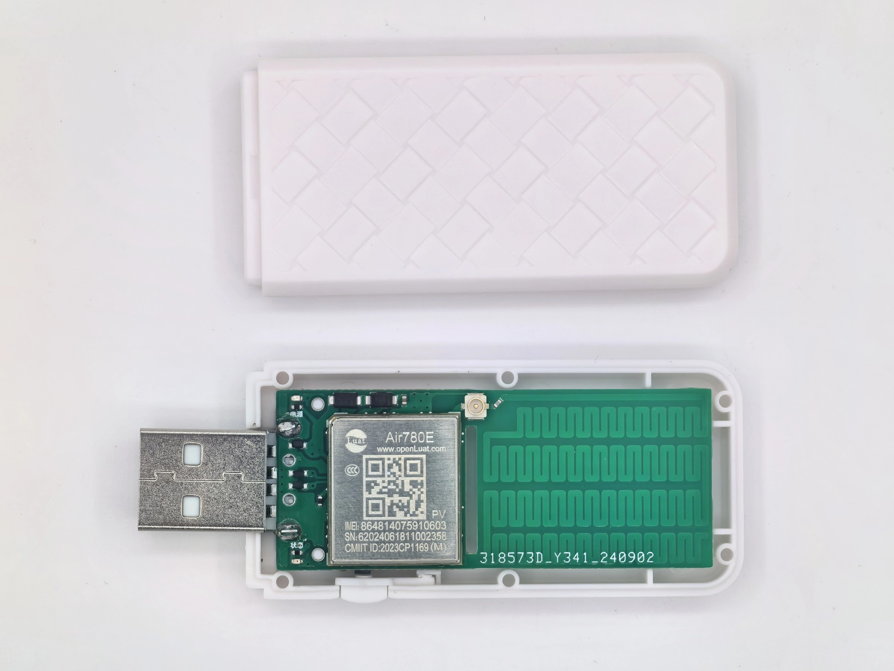

# PyAirLink

PyAirLink is a tool for managing wireless communication modules through a web interface. It supports manual execution of AT commands and provides convenient interfaces based on the standard AT commands defined in `3GPP TS 27.005`, such as sending and receiving SMS.

[中文](README.cn.md)

## Hardware Requirements

1. The module must support UART communication for AT commands. This interface can be a physical TTL port or a logical connection (for example, via USB, Ethernet, TCP Server, etc.).  
2. You need a server (operating system is not strictly limited, but it has only been tested on Linux) that can connect to the module via a standard UART method.  
3. If the module does not automatically show a TTL interface after plugging in the USB, you can try the following commands (example shown for Linux):  
   ```shell
   # Add the USB device ID so the interface is recognized. Adjust the ID (1286 4e3d in the example) according to output from lsusb.
   sudo modprobe option
   sudo sh -c 'echo 1286 4e3d > /sys/bus/usb-serial/drivers/option1/new_id'

   # After this step, you might see several /dev/ttyACM* or /dev/ttyUSB* devices.
   # You can verify a particular device using a serial tool like minicom:
   sudo minicom -D /dev/ttyACM0
   ```

## Features

1. Web API for configuration and management
2. Automatic SMS forwarding:
   - Email
   - Bark
   - ServerChan (Server酱)
3. Scheduled or manual module reboot
4. Scheduled or manual SMS sending
5. Custom AT command execution

## Background

PyAirLink was designed to easily enable multiple SIM cards to remain active while automatically forwarding received SMS messages, without requiring expensive hardware.

**Advantages**  
- All functionalities are integrated on the server side, making it easy to run multiple instances to manage multiple SIM cards.  
- Requires only minimal module capabilities—any correct module purchase can potentially work on any network.  
- Has no special hardware requirements, keeping costs low. The following is one module example (AT firmware):  
    
- The module and the server do not need to be physically colocated. There are two approaches:  
  - Use a module with DTU firmware, and configure both sides to interact via the manufacturer's platform or your own cloud (using SIM card data).  
  - Use an additional TTL-to-network converter for the module.  
- No soldering or hardware flashing is required.

**Disadvantages**  
- Requires a server, which is not power efficient compared to other solutions.  
- The module is not portable. If portability is required, an eSIM-based solution such as 5ber might suit better.

## Usage

1. Identify/define the path of your module interface. On Linux, it is generally `/dev/ttyACM*` or `/dev/ttyUSB*`; on Windows, it is typically `COM*`.  
2. Confirm the baud rate.  
3. Ensure the module is properly powered on.

### Source Code

```shell
git clone https://github.com/zsy5172/PyAirLink.git
cd PyAirLink
pip install -r requiremenets.txt
cp config.ini.template data/config.ini
# Modify config.ini based on your environment
python main.py
```

### Container

```shell
docker run -d -p 10103:10103 -v /PyAirLink/data:/PyAirLink/data --device=/dev/ttyACM0 --name PyAirLink --restart always ghcr.io/zsy5172/pyairlink:master
```

Make sure to update the path mappings according to your setup before running. Copy the contents of `config.ini.template` into `/PyAirLink/data/config.ini` and modify the configuration as needed.

Once started, you can access the web interface at [http://localhost:10103/docs#/](http://localhost:10103/docs#/).